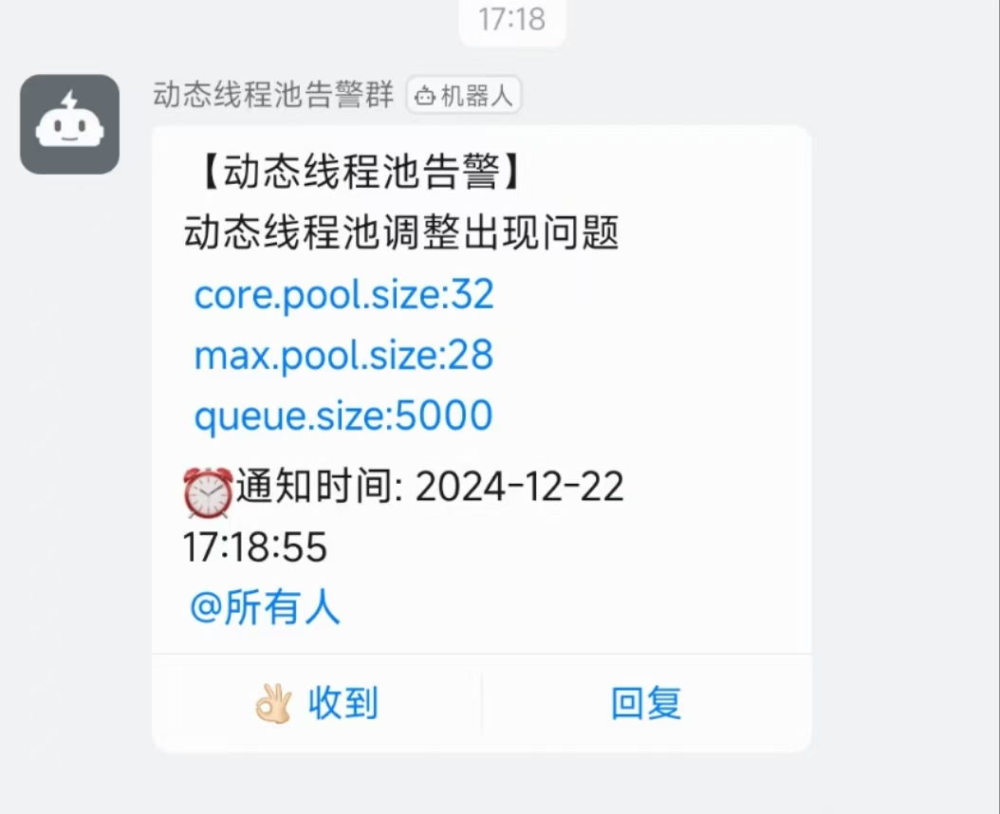

# Dynamic Thread Pool 「动态线程池」
### 项目介绍
#### 简介
本项目是一个动态线程池项目，可以通过spring boot starter的形式引入到业务项目里面,自带管理端，便于监控和显示动态线程池的信息，动态的修改线程池的参数信息，并且支持业务项目通过自定义插件的形式来对动态线程池进行增强，并且提供3种不同的告警模式，可以支持动态配置，解决并发业务中实际环境复杂，线程池参数不易设置恰当，而重新设置参数却需要重启系统的弊端

#### 技术选型
Spring Boot
Redis

#### 项目预览

#### 配置文件