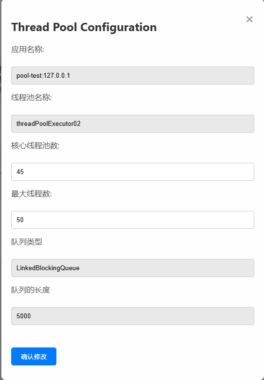

# Dynamic Thread Pool 「动态线程池」
### 项目介绍
#### 简介
本项目是一个动态线程池项目，可以通过spring boot starter的形式引入到业务项目里面,自带管理端，便于监控和显示动态线程池的信息，动态的修改线程池的参数信息，并且支持业务项目通过自定义插件的形式来对动态线程池进行增强，并且提供3种不同的告警模式，可以支持动态配置，解决并发业务中实际环境复杂，线程池参数不易设置恰当，而重新设置参数却需要重启系统的弊端

#### 技术选型
Spring Boot
Redis

#### 项目预览




#### 配置文件
```
spring:
  #如果想要邮件通知才进行配置，不然不需要
  mail:
    # 下面这个是QQ邮箱host ， 企业邮箱 smtp.exmail.qq.com
    host: smtp.qq.com
  # tencent mail port  这个是固定的
  port: 465
  # 你的QQ邮箱
  username: ********@qq.com
  # 进入邮箱配置后得到的授权码
  password: ************
  test-connection: true
  properties:
    mail:
      smtp:
        ssl:
          enable: true
# 动态线程池管理配置
dynamic:
  thread:
    pool:
      config:
        # 状态；true = 开启、false 关闭
        enabled: true
        # redis host
        host: 127.0.0.1
        # redis port
        port: 6379
        #可选
        password: 123456
dynamic-thread-pool:
  alarm:
   #是否开启告警功能
    enable: true
   #想要推送的平台，支持email,feishu,dingding
    use-platform: dingding
    webhook:
       #飞书和钉钉机器人的webhook
      feishu: **********
      dingding: ***********
```
